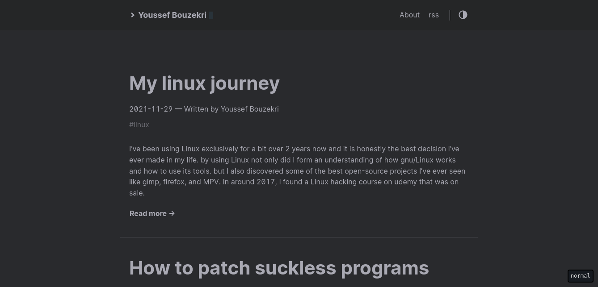

# spcbfr's blog
The source code for my technical blog, for this blog I am using hugo as the backend, and ox-hugo to export my org mode files to markdown which is then read by hugo. I am also using the [hello-friend theme](https://github.com/panr/hugo-theme-hello-friend) by panr.
You can read through the blog from [here](https://spcbfr.vercel.app)
# screenshots

